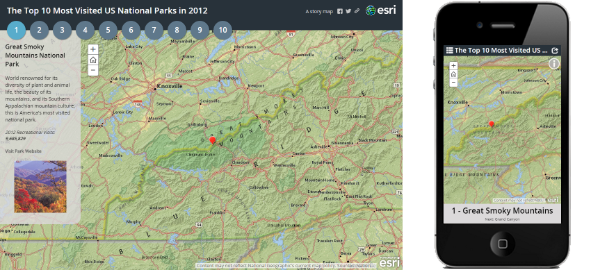
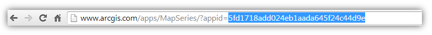

Story Map Series
================

The Story Map Series app lets you present a series of maps via tabs, numbered bullets, or a side accordion. In addition to maps, you can also include images, video and web content in your series to tell your story and engage your audience. For example the first tab in a tabbed series can be a compelling photo that sets the scene. Actions can also be defined in an entry's text so that, for instance, clicking a word automatically zooms the entry's map to a particular location.



[View it live: tab layout](http://links.esri.com/storymaps/map_series_example_tabbed) |
[View it live: accordion layout](http://links.esri.com/storymaps/map_series_example_side_accordion) |
[View it live: bullet layout](http://links.esri.com/storymaps/map_series_example_bullet)


[Download](http://links.esri.com/storymaps/map_series_template_zip) |
[Map Series page on Esri Story Maps website](http://links.esri.com/storymaps/map_series_app)

**Latest release is version 1.14.0**, if you want to be informed of new releases, we recommend you to watch this repository ([see GitHub help](https://help.github.com/articles/watching-repositories)). See the [release page](https://github.com/Esri/map-series-storytelling-template-js/releases) for release notes.

For more infomation about using and customizing Esri's Storytelling Apps follow the [Story Maps Developers' Corner](https://developerscorner.storymaps.arcgis.com).

## Help content

 * [Introduction](#introduction)
 * [Instructions](#instructions)
 * [Feedback / support](#feedback--support)
 * [FAQ](#faq)
 * [Configuration](#configuration)
 * [Customize the look and feel](#customize-the-look-and-feel)
 * [Developer guide](#developer-guide)
 * [Issues](#issues)
 * [Contributing](#contributing)
 * [Licensing](#licensing)

## Introduction
A Map Series application can be created from [ArcGIS Online](http://arcgis.com), from the [Esri Story Maps website](http://storymaps.arcgis.com/) or from a [Portal for ArcGIS](http://www.esri.com/software/arcgis/arcgisserver/extensions/portal-for-arcgis) deployment. The Series's data are stored in a Web Application Item (this includes the narrative content, reference to the webmap(s), pictures, videos and the settings).
This repository provides the application source code for developers that want to customize Map Series.

For more information about the Map Series, including a gallery of examples and a step-by-step tutorial, please see the [Map Series](http://links.esri.com/storymaps/map_series_app) page on the [Esri Story Maps website](http://storymaps.arcgis.com/).

## Instructions
First create your Map Series in ArcGIS Online using the [step-by-step tutorial](http://storymaps.arcgis.com/en/app-list/map-series/tutorial/).
Once your story is ready, you have to find its ID in ArcGIS Online. The ID is a 32 character string that you will find in your web browser's address bar when you are viewing your series.



1. [Download the application](http://links.esri.com/storymaps/map_series_template_zip)
2. Deploy the application on your webserver. See [FAQ](#how-to-deploy-the-application-on-a-web-server) for details
3. Edit index.html, find the configuration section on line 39 and paste in your application ID
4. Navigate to index.html (e.g., `http://127.0.0.1/MapSeries/index.html`)

Enjoy!
You can continue to use the builder in ArcGIS Online to modify your story.
See [customize the look and feel section](#customize-the-look-and-feel) or [developer guide](#developer-guide) if you want to modify the app.

*If you are using Portal for ArcGIS, please follow the instructions at the end of `app/config.js` to configure the application. Optionally you can also [configure the application](#can-the-template-be-used-offline) to use the ArcGIS API for JavaScript included on your Portal.*

## Feedback / support
We would love to hear from you!
* [StoryMaps Website](http://storymaps.arcgis.com/)
* [Let us know about your application](http://storymaps.arcgis.com/en/gallery/submission-form/)
* [Story Maps forum on GeoNet](http://links.esri.com/storymaps/story_maps_geonet)
* [@EsriStoryMaps](http://twitter.com/EsriStoryMaps)
* [ArcGIS Blog](http://blogs.esri.com/esri/arcgis/)

When you contact us, don't hesitate to include a link to your application to make it easier for us to understand what you are working on.

## FAQ

### What should I check before publishing a Series?
We recommend that you perform the following checks before sharing your Series with your audience:
 - Check that all your content is shared with your audience (webmaps, medias, ...). Typically you can use another computer than the one you have used to build your story to make sure everything is loading properly. Alternatively [this article](http://browsers.about.com/od/faq/tp/Incognito-Browsing.htm) will show you how to configure your browser for an incognito session or you can just sign-out from ArcGIS Online and any service that you have used to host your resources.
 - Try the application on different browsers, screen resolutions and mobile devices. You can [emulate mobile  devices](http://mobiletest.me/) inside your desktop browser.

### What are the supported browsers?
Map Series is supported on Internet Explorer 11 and above, Chrome, Firefox, Safari and the most recent tablet and smartphone devices.
Map Series authoring is supported on the same desktop browsers listed above, and on the most recent tablet but not smartphone devices.

We actively test the application in all major browsers but if you experience difficulties especially with the builder, we recommend that you use [Chrome](https://www.google.com/intl/en_us/chrome/browser/).

### Tips for your content

#### Link between entries
One popular request is to add the ability to navigate between a Series's entries using links in the panel or through map features popup. As of April 2018, this ability is now available in the builder.

To add a link to another entry in the narrative panel, highlight the text for which you want to create the link and use the `Naviage to an entry` action in the toolbar. See [this blog](https://blogs.esri.com/esri/arcgis/2016/09/14/whats-new-story-maps-september-2016/) for more information.

You can also add this capability to map feature popups. This can, for example, allow the first entry map to be the spatial index to your story. To do that you need to download the application and include a piece of code in `app/custom-scripts.js`. Modify that file as shown below. Follow the instructions to configure the web map and the layer that will receive the click event.


```
define(["dojo/topic"], function(topic) {
  /*
   * Custom Javascript to be executed while the application is initializing goes here
   */

  // The application is ready
  topic.subscribe("tpl-ready", function(){

  /*
   * Set up a click handler on the feature of the map to navigate the story
   */

  //
  // *************************************
  // Configure the webmap id and layer id
  // *************************************
  //
  // First find the webmap id through the URL when you open the map in Map Viewer
  // To get the layer id, paste the webmap id below and open the application,
  //   then open the developer console, all the layers ids will be listed,
  //   find the correct one and paste it below
  // After this setup, clicking the 3rd feature of your layer, will navigate to the third entry
  var WEBMAP_ID = "0bb11c0469f042b3afaf8b0d76572822";
  var LAYER_ID = "csv_7673_0";

  var clickHandlerIsSetup = false;

  topic.subscribe("story-loaded-map", function(result){
    if ( result.id == WEBMAP_ID && ! clickHandlerIsSetup ) {
      var map = app.maps[result.id].response.map,
        layer = map.getLayer(LAYER_ID);

      console.log(map.graphicsLayerIds);

      if ( layer ) {
        layer.on("mouse-over", function(e){
          map.setMapCursor("pointer");
          map.infoWindow.setContent("<b>"+e.graphic.attributes.name.split(",")[0]+"</b><br/><i>Click to zoom</i>");
          map.infoWindow.show(e.graphic.geometry);
        });

        layer.on("mouse-out", function(e){
          map.setMapCursor("default");
          map.infoWindow.hide();
        });

        layer.on("click", function(e){
          var index = e.graphic.attributes["__OBJECTID"];

          // Temporarily prevent the new bullet to be focused
          app.isLoading = true;

          topic.publish("story-navigate-entry", index);

          // Set back isLoading
          setTimeout(function(){
            app.isLoading = false;
          }, 100);
        });
      }

      clickHandlerIsSetup = true;
    }
  });
});
```

### Security

#### Can I keep my Series private?
Yes, the regular ArcGIS Online security model applies.
By default your Series is private, you can share it through Map Series builder or ArcGIS Online.
When you share your Series, it is your responsibility to make sure that all the resources of your Series (webmaps, images, videos) are accessible to your audience.

#### Who can edit my Series?
A Series can only be edited by its owner (the named account that initially created the Series). Organization Administrator (does not apply for public account) can take or give the Series ownership to another user. In that case you won't anymore be able to edit the Series. Changing the ownership is the only way to collaborate on a Series creation without sharing the owner's credentials.

#### Can I use private web map or layer?
Yes.

When the Series is hosted in ArcGIS Online or Portal for ArcGIS, users that don't have access to the Series or a webmap used in the Series will be redirected to the ArcGIS Online sign-in page. It is not possible to display an authentication dialog in the Map Series when the Series is hosted in ArcGIS Online.

When the Series is hosted on your web server, an authentication dialog will appear inside the application.

Note that for that authentication to work on some older browser (Internet Explorer 9) you need to install a proxy server on your web server to make sure the login credentials can be passed securely to ArcGIS Online. For more information, see the [Using the proxy](https://developers.arcgis.com/javascript/jshelp/ags_proxy.html) in the ArcGIS API for JavaScript documentation.

Because of that limitation, we recommend that you configure the application to use OAuth. OAuth 2.0 based authentication is available for ArcGIS Online and Portal for ArcGIS users with developer or organizational accounts. Follow the procedure to [add an application](http://doc.arcgis.com/en/arcgis-online/share-maps/add-items.htm#ESRI_SECTION1_0D1B620254F745AE84F394289F8AF44B) and [register an application](http://doc.arcgis.com/en/arcgis-online/share-maps/add-items.htm#REG_APP) to get an OAuth application ID. Once you have that application, open `index.html`, locate the `configOptions` section and fill the `oAuthAppId` property.

If you are using secured services but don't want users to have to authenticate, you can use a proxy to store the username/password to be used, see [Working with Proxy Services](https://developers.arcgis.com/authentication/working-with-proxies/#selfhosted-proxy-service), and add a proxy rules to specify what services need to use the proxy by editing `PROXY_RULES` in `app/config.js`.

### Deployment
Deploying a Map Series require to use ArcGIS Online or Portal for ArcGIS. The Series content have to be created using the Map Series builder and will live in a Web Application Item.

#### Can I use the template without ArcGIS Online or Portal for ArcGIS?
This is not a supported use case at that time. Please let us know if you are interested by such a scenario.
Map Series rely heavily on the Portal for ArcGIS API but it is doable to modify the application to support other scenarios.

#### Where is the data stored?
The Series data are stored in a Web Application Item in ArcGIS Online or Portal for ArcGIS. This include the narrative content, reference to the webmap(s), reference to picture(s), video(s), web page(s) and the settings.

The image and videos that you include in your Series using the builder are not copied in ArcGIS Online. You have to make sure that those medias as well as the webmaps you are using are and will remain accessible to your audience.

#### Can I deploy Map Series on Portal for ArcGIS?
Yes, Map Series is included Portal for ArcGIS starting at version 10.3.1. Map Series is not included in earlier version of Portal for ArcGIS but can be deployed on Portal for ArcGIS 10.3. Map Series is not compatible with Portal for ArcGIS prior version 10.3.

Steps:
- [Download the latest version](http://links.esri.com/storymaps/map_series_template_zip)
- Find your Portal `apps/Series` folder (depending on your installation and version of Portal, this is either `C:\Program Files\ArcGIS\Portal\apps\MapSeries` or `C:\Program Files\ArcGIS\Portal\webapps\arcgis#home\webmap\templates\MapSeries`).
 - Remove the content of that folder
 - Extract the archive so that `index.html` is located at `MapSeries\index.html`

 If Map Series was already included in your Portal you are done (Portal for ArcGIS 10.3.1+).

If Map Series was not available in your Portal:
 - Log into Portal for ArcGIS and open My Content > Add Item > Application > Web Mapping Application > Configurable. Configure the URL to `https://portal.domain.com/arcgis/apps/MapSeries`. More details in the following documentation [publishing a new web application item](http://resources.arcgis.com/en/help/main/10.2/index.html#/Adding_applications/019300000031000000/).
 - Create a new group that will reference the template available in your Portal
 - Share the newly created item with that group
 - Open My Organization > Edit Settings > Map  and set the `Web App Templates` to the newly created group. More details in the following documentation [configuring the web application gallery](http://resources.arcgis.com/en/help/main/10.2/index.html#/Configure_map_viewer/017s00000024000000/)
 - Now when you share a web map, the template should be an option

_Note that the archive you downloaded is using the ArcGIS API for JavaScript hosted in ArcGIS Online. This can create some incompatibility with your Portal, if you run into issue, please see the next section to update it._

Also note that the web application gallery preview feature redirects to the StoryMaps website, the target page can be modified in `app/config.js > HELP_URL_PORTAL`.

#### Can the template be used offline?
Yes, by using Portal for ArcGIS and configuring the template to use the ArcGIS API for Javascript included with the Portal.

To edit the ArcGIS API for JavaScript, edit `index.html` and locate `pathJSAPI` around line 70. The URL is `//webadaptor.domain.com/arcgis/jsapi/jsapi` where arcgis is the name of your Web Adaptor.

When deployed on a Portal for ArcGIS instance, the application doesn't require any external service to function. But by default the template will still include the header social buttons and Series author are able to import pictures and videos from the some online pictures hosting services. These options can be disabled individually through the configuration file `app/config.js`.

#### Can I use the builder with the downloadable?
Yes, when the template is configured with an application ID, adding the URL parameter 'edit' will open the builder. You will be prompted for user authentication through the Identity Manager.

#### How to deploy the application on a web server?
If you are not familiar with web servers here are two solutions:
 * Use the web server that comes with your server Operating System. On Windows this is Internet Information Services (IIS), if you have a `C:\inetpub\wwwroot` folder on your computer, you should be able to access it's content using `http://localhost`
 * On Windows or Mac OS, use a simple web server like [Mongoose](https://code.google.com/p/mongoose/) (not recommended for production)

If you are experiencing some rendering issues like improper symbol appearing instead of icons, you will have an extra configuration to perform. Some servers require to configure a new mime type to be able to serve Map Series fonts correctly. See the following links for more information:

 * [IIS Mime types](http://codingstill.com/2013/01/set-mime-types-for-web-fonts-in-iis/)
 * [Properly serve webfonts](http://blog.symbolset.com/properly-serve-webfonts)

#### Can I use a single deployment of Map Series for multiple stories?
Yes.
If you have customized the application and deployed it on your server, you don't need to copy it multiple times, edit index.html and paste a different application ID for each story you want to publish.

Instead edit `index.html`, locate the `configOptions` section and fill the `authorizedOwners` property with the ArcGIS Online or Portal for ArcGIS login of the owner(s) of the Series you want to use. This make possible for the application to display any of the Series created by the specified user(s) through an URL parameter.

Example of the same application displaying two stories:
 * http://myserver.com/MapSeries/index.html?appid=c7ad1a55de0247a68454a76f251225a4
 * http://myserver.com/MapSeries/index.html?appid=c7ad1a55de0247a68454a76f251225a5

## Configuration
In addition to the configuration offered by the builder, the file `app/config.js` provide various additional settings. This is for example the place where you can override some settings like the list of Geocoder services to be used (changes override ArcGIS Online or your Organization default settings). See the documentation provided in that file for more details.

## Customize the look and feel

### Custom color theme
As Map Series doesn't yet offer the ability to create a custom theme through the builder, customizing the various colors of the application requires changing the data of your app. See [our blog post](https://developerscorner.storymaps.arcgis.com/customizing-theme-colors-in-map-journal-and-map-series-6e45b84c277e) about customizing theme colors.

You could also download and configure colors through `app/config.js`. For example if you are using the tabbed layout and have kept the default theme, open `app/config.js`, locate the `LAYOUT` property and edit the following line with the desired colors.

```
themes: [
  {
    name: "tab-default-1",
    // Group of matching theme across layout
    group: "default",
    themeMajor: "white",
    // Header background
    header: "#28323A",
    ...
  }]
```

### Other customization
Most of the look and feel customization can be done using the [regular Application Download](http://links.esri.com/storymaps/map_series_template_zip) and including the css/html overrides directly into `index.html`.

As the application Javascript and CSS are minified, **we don't recommend that you directely edit those files** (e.g. `app-viewer-min.css`, `app-viewer-min.js`, ...). In addition to being hard to edit, this will make application update complex for you.

If you want to change the behavior of one functionality or want to add new one, follow the [developer guide](#developer-guide) below.

The easiest way to find the id or path of a DOM element that you want to customize is to use your browser developer tool, read documentation for [Chrome](https://developers.google.com/chrome-developer-tools/), [Safari](https://developer.apple.com/library/safari/documentation/AppleApplications/Conceptual/Safari_Developer_Guide/Introduction/Introduction.html), [Firefox](https://developer.mozilla.org/en-US/docs/Tools).

Customization can achieved through the `style` tag already present for you in `index.html` (search for `/* CUSTOM CSS RULES */`).

## Developer guide
This developer guide is intended for developers who want to modify the behavior of or add new functionalities to the Map Series application.
It requires knowledge of HTML, Javascript and CSS languages.
If you only need to customize the look and feel, you should be able to do so using the [customize section above](#customize-the-look-and-feel).

### Application life cycle
Map Series fires events that allow customization with lose integration. This mean that you don't need to understand the application internals to implement simple extension.

To try those events, look for the `Custom Javascript` block at the far end of index.html.

```
...
require(["dojo/topic"], function(topic) {
  /*
   * Custom Javascript to be executed while the application is initializing goes here
   */

  console.log("Map Series is initializing");

  // The application is ready
  topic.subscribe("tpl-ready", function(){
    /*
     * Custom Javascript to be executed when the application is ready goes here
     */

    console.log("Map Series is ready");
  });

  // When an entry is being loaded (don't wait for the Main Stage media to be loaded)
  topic.subscribe("story-load-entry", function(index){
    console.log("The entry", index, "is being loaded");
  });

  // After a map is loaded (when the map starts to render)
  topic.subscribe("story-loaded-map", function(result){
    if ( result.index !== null )
      console.log("The map", result.id, "has been loaded from the entry", result.index);
  });
});
...
```

### Developer helpers
In addition to the events described above, the story data, configuration and useful helpers functions can be accessed through the global variable `app`.

```
console.log("Entry", app.data.getCurrentEntryIndex(), "/", app.data.getStoryLength() - 1);
console.log("Current map", app.map);
console.log("IDs of all the webmaps used in the story", app.data.getWebmaps());
console.log("Current entry's data", app.data.getCurrentEntry());
console.log("All entries data", app.data.getStoryEntries());
console.log("Story layout configuration", app.data.getWebAppData().get().values.settings.layoutOptions);
console.log("Static ayout configuration values", app.data.getCurrentLayoutStaticConfig());
```

Some events are also available for you to navigate the Series programmatically:

```
require(["dojo/topic"], function(topic) {
  // Navigate to an entry
  topic.publish("story-navigate-entry", 2);

  // Reload the content panel
  topic.publish("story-update-entries");
});
```

### Environment setup

Clone the repository or download a [copy of the repository as a zip file](https://github.com/Esri/map-series-storytelling-template-js/archive/master.zip).

To build a production version of the application from the source code, you first need to install [Node.js](http://nodejs.org/).

Then initialize the environment by running the following commands **in the MapSeries folder**:
 * `npm install`
 * `npm install –g grunt-cli`

This will create a new `node-modules` folder in your project root with all the tools required to build the application. If you have trouble running the second command, [see this documentation on how to install grunt-cli locally](https://github.com/gruntjs/grunt-cli#installing-grunt-cli-locally).

### How to use the application from the source code
 * Make accessible the MapSeries folder on a web server. Use your favorite server or run one with `grunt server`, this will start a server on port `8080`
 * If using a Portal for ArcGIS instance configure the sharing url `app/config.js` (last property)
 * Use the URL parameter `appid` to specify the web item to be loaded, e.g.: http://localhost:8080/?appid=ABCD (configuring index.html > configOptions.appid is not supported in development mode)

### How to build application from the source code
  * Open a terminal and navigate to the MapSeries folder
  * Run the following command: `grunt`

The deploy folder now contains the built application that you can deploy to your web server.

### Issues building the application

The build script perform code validation through [JSHint](http://www.jshint.com/), you can disable those validations by editing Gruntfile.js and look for the following comments `/* Comment out to disable code linting */`.

### Design
Map Series relies on AMD and Dojo loader [AMD](https://developers.arcgis.com/javascript/3/jshelp/inside_dojo_amd.html) for application structure.

The application is structured as this:

| Path          			                  	| Contains																						|
| ---------------------------------------------	|  -------------------------------------------------------------------------------------------- |
| Gruntfile.js									| Build configuration																			|
| src/											| Main source code folder with index.html and the Eclipse project configuration					|
| src/app/										| Javascript and CSS source code 																|
| src/app/config.js			            		| App configuration file (loaded at execution time) 											|
| **src/app/storymaps/common/**					| Modules common across storymaps templates (main module is Core.js)							|
| src/app/storymaps/common/builder/				| Builder modules (main module is Builder.js)													|
| src/app/storymaps/common/mapcontrols/			| Map UI components (Overview, Legend)															|
| src/app/storymaps/common/ui/					| UI components																					|
| src/app/storymaps/common/utils/				| Utils, connector,...																			|
| src/app/storymaps/common/_resources			| Static resources																				|
| **src/app/storymaps/tpl/**					| Map Series modules (build configuration files in the root)									|
| src/app/storymaps/tpl/builder/				| Builder modules (main module is BuilderView.js)												|
| src/app/storymaps/tpl/core/					| Core modules (main module is MainView.js) 													|
| src/app/storymaps/tpl/ui/						| UI components of the viewer grouped by target device											|
| src/lib-app/									| Dependencies (included in the final app)														|
| src/lib-build/								| Dependencies used by the build (not included in final app)									|
| src/resources/								| Static resources																				|


The main dependencies are:
 * [jQuery](http://jquery.com/)
 * [Bootstrap](https://getbootstrap.com/docs/3.3/)
 * [CKEditor](http://ckeditor.com/)
 * [iDangero.us Swiper](http://www.idangero.us/sliders/swiper/)

The application Javascript and CSS are minified into four files:

| File			        |										                                        |
| --------------------- | ----------------------------------------------------------------------------- |
| app/viewer-min.css	| Compressed CSS loaded when accessing the Map Series as a viewer		        |
| app/viewer-min.js	    | Compressed Javascript loaded when accessing the Map Series as a viewer	    |
| app/builder-min.css	| Compressed CSS loaded when accessing the Map Series as an author		        |
| app/builder-min.js	| Compressed Javascript loaded when accessing the Map Series as an author	    |

Depending on the URL parameters, index.html will load the corresponding files.

## Issues
Find a bug or want to request a new feature?  Please let us know by submitting an issue.

## Contributing
Esri welcomes contributions from anyone and everyone. Please see our [guidelines for contributing](https://github.com/esri/contributing).

## Licensing
Copyright 2018 Esri

Licensed under the Apache License, Version 2.0 (the "License");
you may not use this file except in compliance with the License.
You may obtain a copy of the License at

   http://www.apache.org/licenses/LICENSE-2.0

Unless required by applicable law or agreed to in writing, software
distributed under the License is distributed on an "AS IS" BASIS,
WITHOUT WARRANTIES OR CONDITIONS OF ANY KIND, either express or implied.
See the License for the specific language governing permissions and
limitations under the License.

A copy of the license is available in the repository's [LICENSE.txt](LICENSE.txt) file.

Some open-source components of this project are licensed under other License terms, see `src/lib-app/` folder for respective licence files.

| Library               | License   |
| --------------------- | --------- |
| Bootstrap 			| MIT 		|
| CKEditor 				| LGPL		|
| jQuery 				| MIT 		|
| jQuery Colorbox 		| MIT 		|
| iDangero.us swiper 	| MIT 		|
| Clipboard.js          | MIT       |
| History.js			| BSD 		|
| jQuery UI 			| MIT 		|
| FastClick 			| MIT 		|
| jQuery UI Touch Punch | MIT 		|
